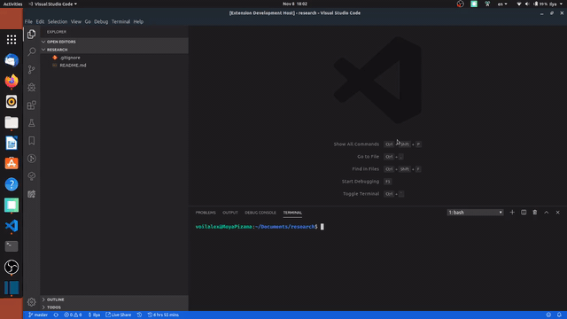
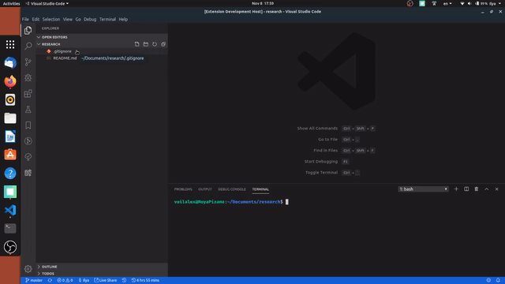

# Open in IPython | Visual Studio Code

Using this extension you can open a file in IPython session right from File Explorer. It's helpful sometimes, I think.

## Features

### Opening with command pallet

### Opening with context menu

## Requirements

You should have IPython installed on your machine.

## Extension Settings

## Known Issues

## Release Notes

Users appreciate release notes as you update your extension.

### 1.0.0

Initial release of 'Open in Python'.
